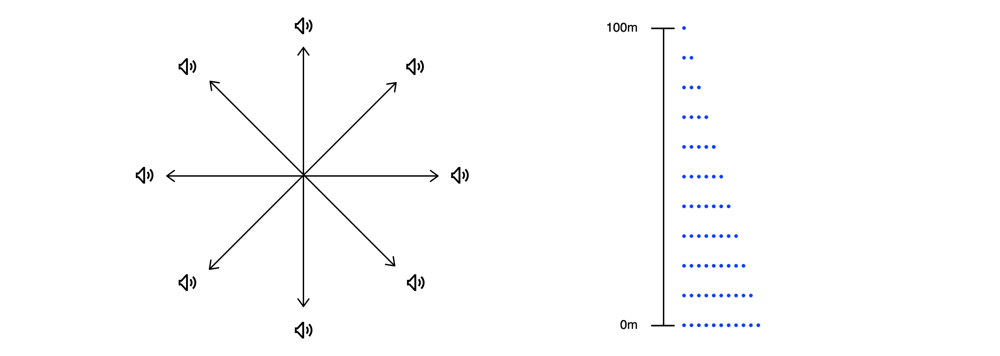

# Peer locator

Peer locator allows users to pair remotely and locate each other using peer to peer technologies.

### Example use cases:
- Outdoor deliveries.
- Otherwise meetings with strangers, where it's important to verify meeting the correct person (e.g. an exchange student being picked up at the airport).
- Finding people in buildings, caves or other places that don't have GPS access.
- Finding caregivers or things for visually impaired people.

### Focus on privacy: 
- The user's location is never shared remotely.
- No personal data is shared when pairing. Only session-specific public keys, which are deleted immediately after being shared.

### UWB technology, with fallback to BLE
UWB (ultra wideband technology) allows to determine distance and direction accurately and it's used when available. If the device doesn't support it, or users are at a distance covered by BLE but not UWB, the app switches automatically to BLE. BLE is less accurate and isn't good to detect direction, so the UI is adjusted accordingly.

### How does it work?
Users generate a key pair for a session, share their public keys and use it to identify each other when nearby. Since remote pairing is not supported by the BLE standard, the entire authentication process is custom.

This process, basically, consists of broadcasting/serving a signed message, which allows users to verify the peer via BLE with the shared public key. Once the verification is done, location updates will be accepted and shown on the UI. An UWB session will be initiated via this newly created BLE channel, and UWB location updates will override the BLE updates when available. The BLE session data is regularly re-verified to prevent e.g. replay attacks.

### Backend

A backend is not strictly necessary, as users technically can share their public keys with each other directly, but convenient: a session can be configured by just sharing a deep-link. The app takes care of everything and it also prevents users from possibly sharing their public keys via insecure channels. "Public" key is not to understand literally here, as it acts as peer identifier and anyone who gets hold on it will be able to detect the peer when nearby, which is probably not wanted, in most cases.

### Pairing via QR codes

The session deep link can also be shared via QR code. This enables more convenient nearby pairing as well.

### Apps architecture

- Currently only the iOS app is usable. There's a skeleton for an Android app. There's an Apple Watch app with limited functionality (the currently most recent Series 6 doesn't support BLE peripheral, so can't be used to pair in standalone mode).

- There's a core for the apps written in Rust, that handles things like communicating with the backend.

- The apps have a layered architecture, with services at the core that communicate with the UI reactively (using SwiftUI/Combine and Coroutines respectively).

- The BLE and UWB handling is component based as well. The events received from the OS framework are broadcasted to granular components that process them and broadcast respectively to the outer layers. It's possible to mock the BLE and UWB providers / components, e.g. for testing.

- BLE and UWB are piped to a common event source for the UI, to facilitate seamless switching when crossing the max. UWB distance.

### Sound radar

This is a proof of concept of an idea I got while developing the app. It could be used e.g. for visually impaired people to find their caregivers. Basically, the direction is encoded with a sound radar, using a specific, continuous "background" sound, and distance is encoded as the frequency of a short, spaced sound. For example, if the caregiver is 20m away at 3 o'clock, there will be a specific continuos "background" sound, signaling that the the direction is 3 o'clock and a "foreground" "tak-tak-tak" that will become quicker or slower as they move closer or farther apart.

